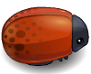

# Arcade Game Master

In this game the user have a **Player** and **Enemies** (Bugs and Snails). The player can move left, right, up and down. The enemies move in varying speeds on the paved block portion of the scene. Once the player collides with an enemy, he lose a life and moves back to the start square. 
The goal of the player is to collect as much possible collectible items without colliding into any one of the enemies. Collectible items appears and disappears randomly. For every item collected, the player get **points**. The game is over when the player lose all his lives (five at the start of the game). At the end of the game, the user is asked if he wants to play again or to leave.

## Enemies: 

Bugs are moving with random speed 
Snails are faster than bugs, always moving with same speed 

## Collectible items:

 Value is 100 points 
 Value is 200 points 
 Value is 300 points 
 Value is 400 points 
 Value is 500 pointst 

## Player:

The user is allowed to select from five images for the player character before starting the game. Also he is allowed to chose a player name.

### Characters

 Boy 
 Cat Girl 
 Pink Girl 
 Horn Girl 
 Princess Girl 

###### _This is a project for Udacity's Front-End Web Developer Nanodegree Program_

